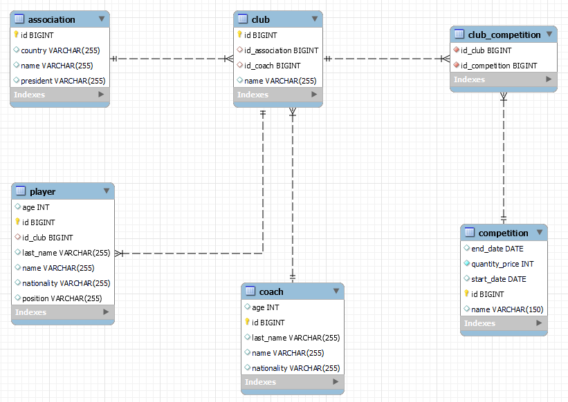

# Administracio equipos de futbol

Practica uso de las relaciones en JPA usando el framework Spring boot de Java, como ORM 
a Hibenate y como base de datos MySQL

## Las 4 principales relaciones a usar
    1 a 1 (Uno a uno)
    1 a n (Uno a muchos)
    n a 1 (Muchos a uno)
    n a n (Muchos a muchos)

## Diagrama DER

